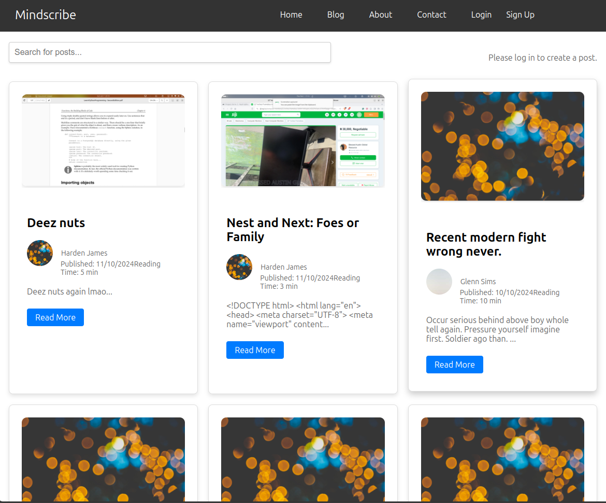

# Mindscribe Blog Frontend 📝

The frontend for Mindscribe, a blog platform built with React.js. This application enables users to explore blog posts, manage their accounts, and interact with the content through seamless user authentication and smooth API integration.

## Features 🚀

- User Authentication: Login, Signup, and Logout
- Post Management: View, create, edit, and delete posts
- Responsive Design: Works across desktop and mobile devices
- Persistent Sessions: Access tokens stored in localStorage for session management
- API Integration: Interact with the backend using Axios

## Technologies Used 🛠️

- React.js: Component-based UI library
- React Router: Client-side routing
- Axios: HTTP client for API requests
- CSS: Styling the components
- JavaScript (ES6+)

## Project Structure 📂

To display your project’s structure;

- Open your terminal and navigate to your project’s root directory.
- Run the tree command to generate the structure. For example:
  use `tree`
- If you don’t have the tree command installed, you can install it using your package manager. For example, on Ubuntu, you can install it with:
  use `sudo apt-get install tree` then use `tree` command

## Installation ⚙️

To get started with the project, follow these steps:

1. Clone the repository

```sh
# Clone the repository
git clone https://github.com/your-username/mindscribe-frontend.git
cd mindscribe-frontend
```

2. Install dependencies

```sh
npm install
```

3. Start the development server

```sh
npm start
```

## Environment Variables 🌍

Make sure the API base URL is correctly configured in axiosInstance.js.

```javascript
// src/api/axiosInstance.js
import axios from "axios";

const axiosInstance = axios.create({
  baseURL: "https://mindscribe.praiseafk.tech", // API Base URL
  timeout: 5000,
  headers: {
    "Content-Type": "application/json",
  },
});

export default axiosInstance;
```

## Usage 🎯

1.  Login User
    Here’s an example of the login functionality:

```javascript
// src/components/Login/Login.js
const handleLogin = async (e) => {
  e.preventDefault();
  try {
    const response = await axiosInstance.post("/api/auth/login", {
      email,
      password,
    });
    const { accessToken, user } = response.data;
    onLogin({ accessToken, user });
    localStorage.setItem("access_token", accessToken);
    navigate("/");
  } catch (error) {
    console.error("Login failed:", error);
    setError("Invalid credentials. Please try again.");
  }
};
```

2.  Fetch User Profile After Login

```javascript
// src/App.js
useEffect(() => {
  const token = localStorage.getItem("access_token");
  if (token) {
    axiosInstance
      .get("/api/auth/profile", {
        headers: { Authorization: `Bearer ${token}` },
      })
      .then((response) => setUser(response.data.user))
      .catch(() => handleLogout());
  }
}, []);
```

## API Endpoints 🔗

Below are the frontend-relevant endpoints:
| Endpoint | Method | Description |
|----------|--------|-------------|
| /auth/login | Post | Login user |
| /auth/signup | Post | Register new user |
| /auth/logout | Post | Logout current user |
| /auth/profile | GET | Fetch logged-in user data |
| /post/ | Get | Posts made on page |

## Screenshots 🖼️

### Login Page


### Blog Page



## Contributing 🤝

We welcome contributions! Please fork the repository, create a branch, and submit a pull request with your changes.

## Author

- Praise Josiah
- Gabriel Emmanuel
